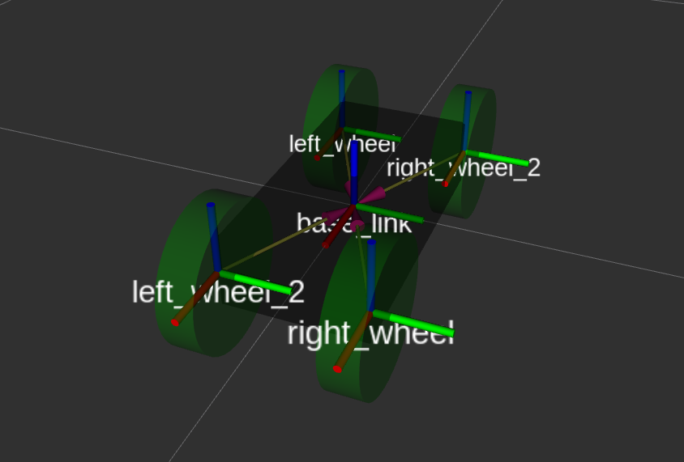

# Изучение системы моделирования RViz и формата данных URDF

## Цели

Пункты 2.1-2.4  http://wiki.ros.org/urdf/Tutorials

## Вариант

Мобильный 4-колёсный робот

## Получившийся робот

Модель робота: MMR-3000 -- Minimalistic Mobile Robot 3000

