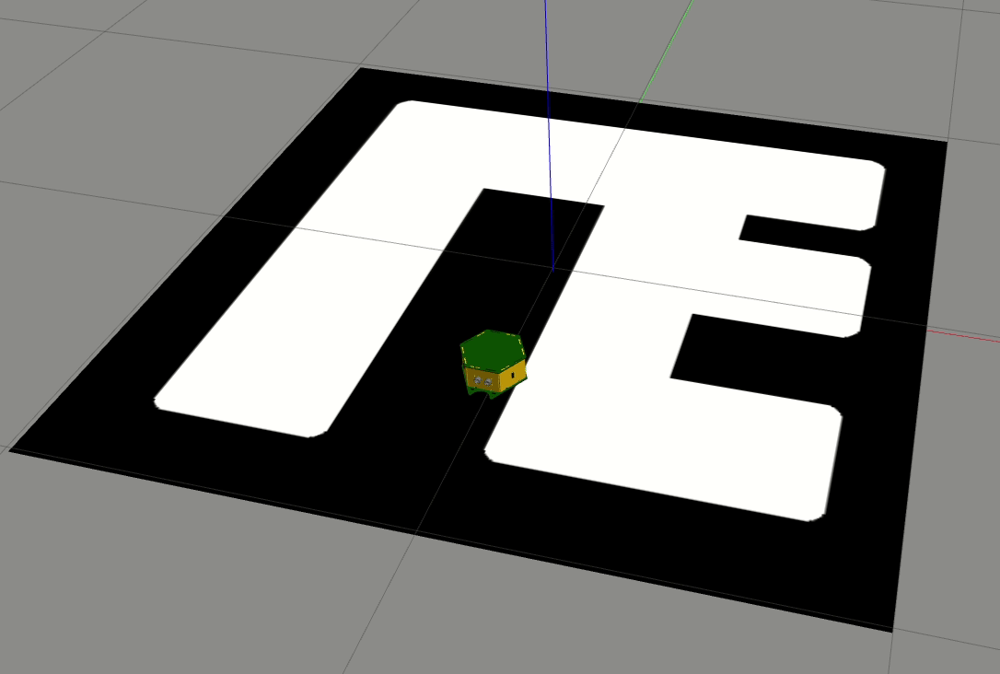

# Разработка системы управления движением автономного мобильного робота на основе таблицы принятия решений.

## Цель
Разработка системы управления движением автономного мобильного робота на основе следящего привода.

## Варианты:
1. по датчикам яркости (датчик reflection). Движение по полосе на полу.
2. по датчикам расстояния (датчик ultrasonic). Движение вдоль стенки.

## Задачи
1. создать 3-мерную трассу (параметры трассы взять из официальных правил "RoboRace").
2. выбрать соответсвующую сенсорную систему мобильного робота.
3. Разработать следящий прривод на основе обработки сенсорных сигналов соответсвующего типа, уазанного в варианте.
4. программно реализовать разработанный привод.
5. протестировать и отладить программу.

## Ссылки
* http://roborace.org/
* https://github.com/robocake/beginner
* https://www.mathworks.com/matlabcentral/fileexchange/75514-vechicle2dsim?s_tid=srchtitle

## Демо алгоритма
Робот совершает движение вперед, если все три датчика яркости (левый, правый, центральный) фиксируют чёрный цвет. Если левый или правый перестают фиксировать чёрный, то робот поворачивается на месте на 45 градусов в соответственую сторону.

